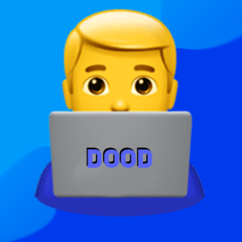

<div align="center">
	<h1>Python is The Best</h1>
	
	<br>
</div>


## What the hell is this?
> My friend was talking trash about Python, so I made him this game as a joke lol

## Can I play?
> Yeah sure, I don't care 😅

## Where do I download this ~~garbage~~ game?
> [Right here!](https://github.com/itsamedood/PITB/releases)

## How can I build the game myself?
> Not sure why you'd want to, but if you really wanna:
> 1\) Clone this repo.
> 2\) Run:
> > ```sh
> > $ python3 -B build.py
> > # Use --debug to build in debug mode.
> > # Use --release to build in release mode.
> > # Add --run to run the game after building.
> > ```
> > Or just press `F5` if you're using [VSCode](https://code.visualstudio.com/).
> >
> > **NOTE:** You need Python 3.10 or higher as the code uses `match-case` syntax.
>
> And boom, you're good to go!


<div align="center">
    <br>
	
</div>
